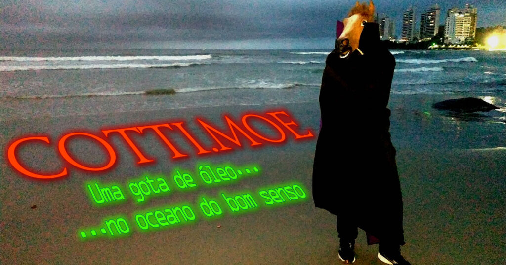

Pela enésima vez nos vemos recomeçando.

Só que agora, depois de décadas de árdua contestação das regras arcanas de outrora da FAPESP, que mantém o [Registro.br](https://registro.br/), finalmente sou o detentor de um domínio que almejava desde a infância.

O de agora.

A última vez que lembro ter pesquisado, o domínio era de um squatter – pois se procurarmos na Wayback Machine não encontramos nada. E antes disso, nem era possível que uma mera pessoa física como eu pudesse ter um `.com.br`. Já tive o `.net.br` por um tempo, que por motivos insanos era mais permissivo que o `.com.br`. Exigiam CNPJ e o caramba – documentação e mais documentação. A flexibilização disso é um fenômeno que chegou com penoso atraso, e a interface de gerenciamento do Registro.br é péssima. Ainda bem que pelo menos funciona fazer essas coisas pelo Cloudflare.

Mas como nada é fácil para o cidadão, `.com.br` é um dos domínios que o Cloudflare não atua como registrar. Assim como o `.moe`. Então ele só atua como DNS e cache mesmo.

Mas eu confesso que vou sentir falta do `.moe`. É uma decisão difícil.

## Cotti.moe – uma breve eulogia

Foi uma disputa de prioridades entre o que me define e o que eu desejava. Certamente o charme da leviandade do `.moe` é a minha cara, ter que explicar o conceito é menos.

Mas a minha criança interior, ironicamente, queria a pomposidade que o .com.br proporcionava (na falta do `.com`, que hoje em dia é de uma marca de café, e da última vez que vi à venda custava a bagatela de pelo menos 50 mil dólares).

Inclusive a questão do nome foi um dos principais motivos para minha escolha na época do [Homestead](https://en.wikipedia.org/wiki/Homestead_Technologies) ao invés do gigante [Geocities](https://en.wikipedia.org/wiki/GeoCities). Outra foi o espaço, 8 megabytes ao invés de uns… 5? Aí tão pedindo pra lembrar muito. Um simples subdomínio no 8m.com (que agora é controlado por um squatter chinês, que tristeza a queda do Homestead), ao invés das 3 ou 4 subpastas no Geocities. Estamos falando aqui de 1999, quando opções de redirecionamento como o cjb.net e o .tk ainda reinavam – ao custo de pop-ups. Opções menos invasivas eram muito bem-vindas, e lembro do Homestead ser mais tranquilo que o Geocities, que também tinha pop-ups.

Mas onde eu estava? Na vontade de ter um domínio e tal. Isso. Eu tive, não necessariamente nessa ordem, `.biz`, `.net.br`, `.moe` e agora `.com.br`. Talvez algum outro…? Realmente nem lembro mais. Faz parte também da minha década perdida, então já viu né.

Mas foi divertido. Passei por diferentes serviços de VPS, cada um comigo fazendo mais caquinha que o outro. Passei a ter o famoso email próprio, ainda que gerenciado por fora. Enquanto eu ainda for dono dele, vai redirecionar qualquer coisa pra cá, mas tenho medo dele virar bolor – ou pior, um squatter comprar. Hoje tem de tudo…

Mas se pá ainda tem espaço para projetos que com alguma certeza não devem ficar por aqui. Vai saber…

Até lá, você me acha aqui. Quer um email mais fácil que [felipe@cotti.com.br](mailto:felipe@cotti.com.br)?

