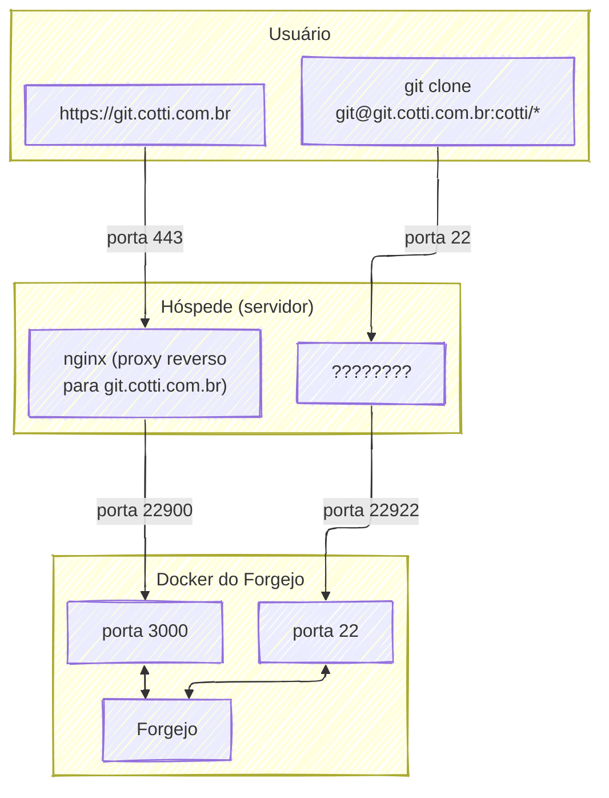
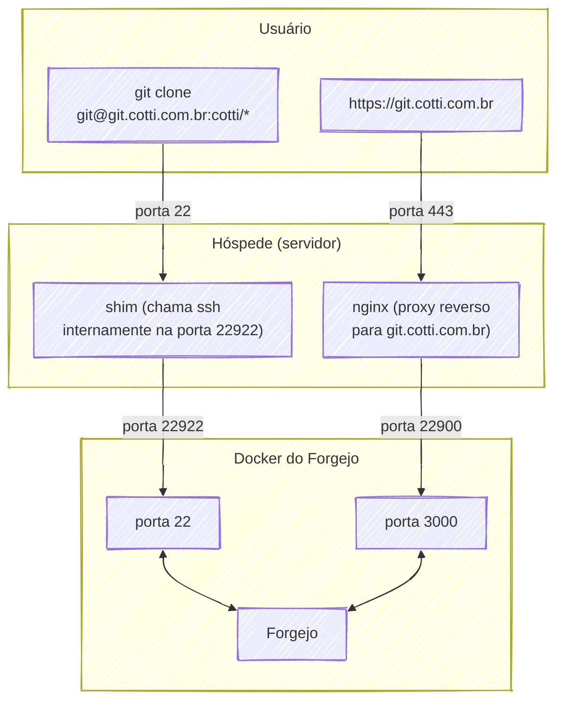

Gente, continua não sendo trivial. Mas pelo menos acho que não quebrei o servidor **completamente**.

A última vez que eu tinha colocado o Gitea, meio que o subdomínio dele se sobrepujava ao www, e tinham algumas coisinhas irritantes que não funcionavam 100%.

Mas eu vi que rolou bastante drama, e o Gitea que era um fork do Gogs porque o Gogs ficou muito comercial, **ganhou um fork porque ficou muito comercial**. E nasceu o Forgejo.

Depois da enorme desventura que foi gastar uma fortuna pra recuperar alguns dados de um SSD falhando da pior forma possível na minha cara – imediatamente antes de eu ter um backup do que eu mais precisava nele – acabou o rolê de protelar. Até porque estou quase perdendo outro disco.

Então a parte do código e de coisas tangenciais a código vão ganhar no mínimo um lar constantemente atualizado no **Gitão dos Bróder** pra evitar essa caca. Aí o que for interessante fazer, vou espelhando no Github.

Mas era importante aqui registrar que não foi só criar um `docker-compose.yml` e um usuário no banco para ele. 

-----

## Túneis e Tapas

Se você caiu de para-quedas no rolê, para desembolar uma instância de uma plataforma de código como Gogs/Gitea/Forgejo, ou Gitlab, ou qualquer outra coisa que permita que você mesmo hospede as coisas, você tem que ouvir e atender pedidos da parte “site” da coisa, e ouvir e atender pedidos SSH, que o git usa para transporte autenticado de dados.

Aí você tem algumas opções. A que fica mais simples para um usuário… usar, é manter a porta `22` para o usuário `git`.

Isso era o que eu queria.




Bati a cabeça um pouco tentando as indicações da documentação do Gitea (porque o Forgejo meio que **esqueceu** de documentar isso), e eventualmente teve uma combinação de opções que me fez sacar o que era para acontecer; a maior parte sendo um *shim* do executável que na verdade faz o túnel para o contâiner como indicado na [documentação do Gitea](https://docs.gitea.com/installation/install-with-docker#sshing-shim-with-authorized_keys).

```shell
adduser git
usermod -aG docker git
usermod -aG sudo git
```

Com isso, temos o usuário para receber os pedidos SSH do Git. Agora, é hora de conferir se tudo no `docker-compose.yml` faz sentido.

Os detalhes de importância são ele escutar explicitamente o `localhost` na porta `22922`, e ter um link de volume para a pasta `.ssh` do usuário externamente.

```yaml
services:

  forgejo:
    image: codeberg.org/forgejo/forgejo:8
    container_name: forgejo
    restart: always
    ports:
      - 22900:3000
      - "127.0.0.1:22922:22"
    environment:
      - FORGEJO__database__DB_TYPE=mysql
      - FORGEJO__database__HOST=mariadb:3306
      - FORGEJO__database__NAME=banco_do_forgejo
      - FORGEJO__database__USER=usuario_do_forgejo
      - FORGEJO__database__PASSWD=senha_do_forgejo
      - USER=git
      - USER_UID=1001 
      - USER_GID=1001 
    volumes:
      - /cotti.com.br/docker/volumes/forgejo:/data
      - /home/git/.ssh/:/data/git/.ssh
      - /etc/timezone:/etc/timezone:ro
      - /etc/localtime:/etc/localtime:ro
    networks:
      - containers

networks:
  containers:
    external: true
```

Então, foi preciso criar uma chave para o usuário `git` do hóspede… acessar o contâiner.

```shell
sudo -u git ssh-keygen -t rsa -b 4096 -C "Gitea Host Key"
sudo -u git cat /home/git/.ssh/id_rsa.pub | sudo -u git tee -a /home/git/.ssh/authorized_keys
sudo -u git chmod 600 /home/git/.ssh/authorized_keys
```

E o shim em si, que é assim:

```shell
#!/bin/sh
ssh -p 22922 -o StrictHostKeyChecking=no git@127.0.0.1 "SSH_ORIGINAL_COMMAND=\"$SSH_ORIGINAL_COMMAND\" $0 $@"
```

A pegadinha é agora. Como não uso uma porta padrão internamente para levar a conexão para o contâiner, adicionei o seguinte no `/etc/ssh/sshd_config`:

```nginx
Match User git
  AuthorizedKeysCommandUser git
  AuthorizedKeysCommand /usr/local/bin/gitea keys -c /data/gitea/conf/app.ini -e git -u %u -t %t -k %k
```

Aí você reinicia o `sshd`, adiciona uma chave SSH no usuário lá na interface web do Forgejo…



Não é que funciona?

Não é que não quero fazer isso nunca mais?