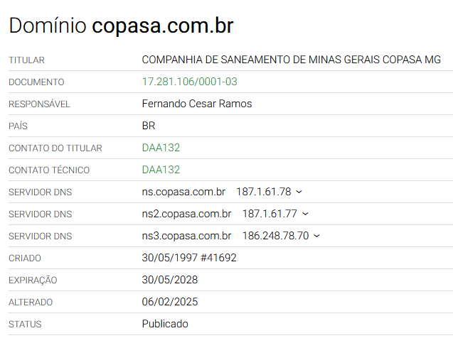
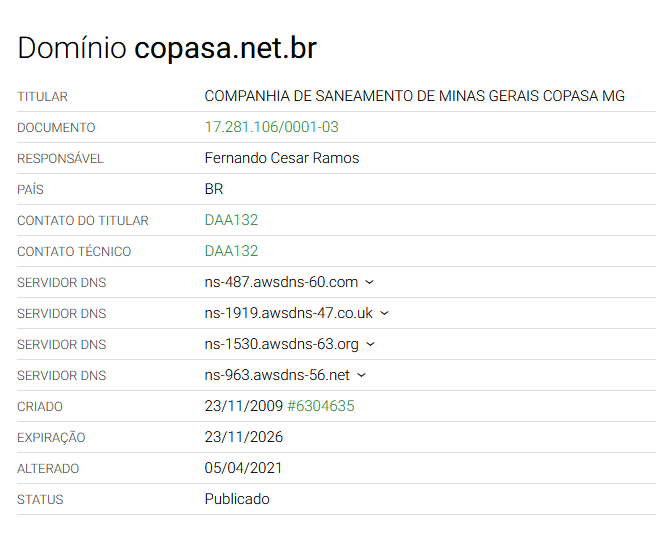
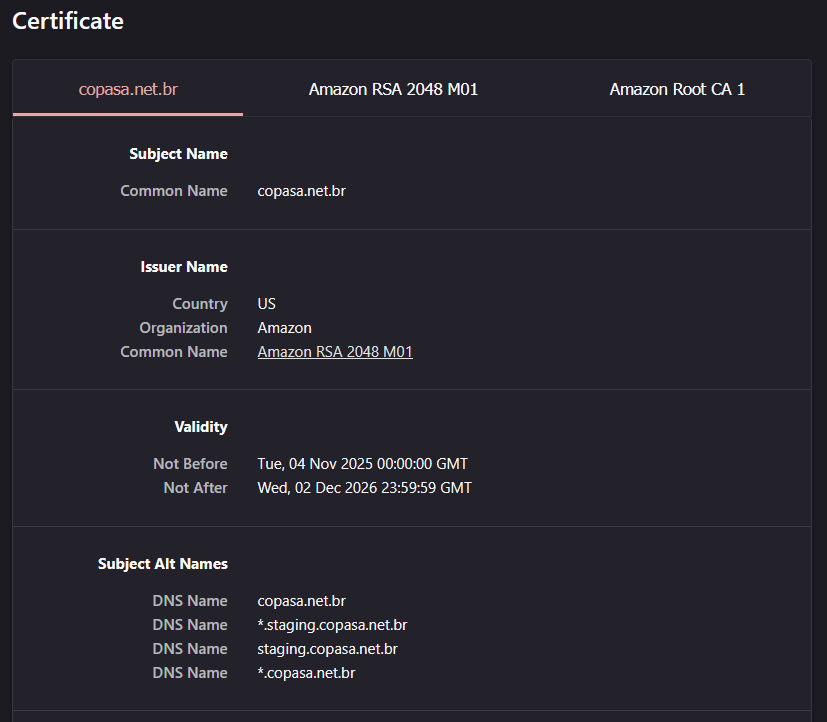
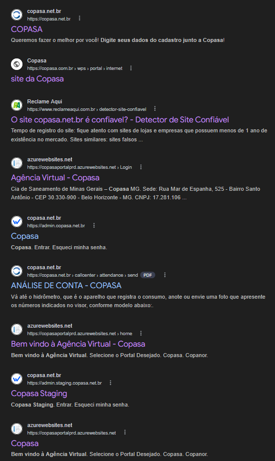

Hoje a patroa me mandou uma imagem de um SMS enviado ao meu sogro, querendo saber se eu tinha recebido alguma conta de água.

O SMS com aquele jeitão de golpe: tentando passar aquela sensação de urgência. Mandando um link com um hashzinho de um endereço que não pode ser real: copasa.**net**.br. Ora, a Copasa é obviamente .**com**.br, né.

...Né?

Eu já ia responder que *é golpe, claro! Só olhar o domínio*... Mas aí eu pensei, "nossa, a Copasa tá mal das pernas na *infosec* hein? Deixaram um maluco afanar um .net.br com o nome dela certinho".

Por curiosidade, fui fazer um WHOIS dos domínios.

OK, parece tudo certo. E o do golpe?

...Hein?

----

Tá, pelo jeito a Copasa separou a parte institucional e a parte de atendimento completamente, incluindo não usar o mesmo domínio. Eu não concordo muito, mas vai saber como são as decisões lá, fora fazer minha mãe ficar sem água por uns 10 dias por pura pirraça processual.

Mas aí você olha o certificado do .net.br.

Véi, sério mesmo que eles usam o mesmo certificado pra staging e produção? Sério que eles expõem staging desse jeito?

Você pesquisa pelo domínio no Guglio da vida, e o SEO deles é um grau pior que inexistente, é negligente. Essa é a primeira página:

Praticamente nada adicionado para facilitar um resultado de busca. Mas acima disso, você acha na primeira página um link para o painel de administração do SaaS que eles usam para o sistema de atendimento. E acima disso que está acima, você também encontra um link para o painel de administração em staging. Eu não vou adiante em mais nada por terror de saber que isso também faz parte do sucateamento estrutural, para depois vender essa coisa a preço de banana.

Eles usam o [WeTalkie](https://wetalkie.com/). Coitados, pagando pelos pecados tendo um cliente assim. A Copasa tem dado dores de cabeça vira e mexe por aqui. O triste destino da marcha da decadência institucional é ela virar outra CEMIG pra convencer a população de que não vale nada. Lastimável.

Eu lembro de ter ido em uma excursão a uma estação de tratamento quando eu era criança. Lembro dos tanques de filtragem, de decantação. Mas não lembro mais quando foi, quem eu tinha como colega, coisas assim.

Seria bom se dessem um trato na segurança dos dados da população que depende dela, porque essa exposição toda dá medo.
