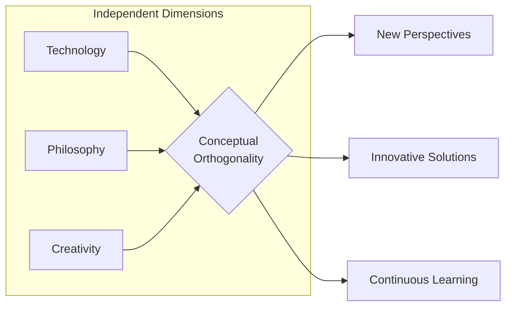

Welcome to **Conceptual Orthogonality**!

This is the first post on this blog, a space where I intend to share ideas, projects, and reflections about technology, software development, and other topics that interest me.

<!--more-->

## What to expect

Here you will find content about:

- **Software Development**: Tutorials, tips, and thoughts on programming
- **Technology**: Analysis and opinions on tools and trends
- **Personal Projects**: Documentation of my learning journey

## Why "Conceptual Orthogonality"?

The name comes from the mathematical concept of orthogonality — perpendicular vectors, independent from each other. This blog explores ideas that, while distinct, complement each other when analyzed from different angles.

## Next steps

Feel free to explore the blog and, if you'd like, get in touch through the [About](/en/about) page.

See you in the next post!

